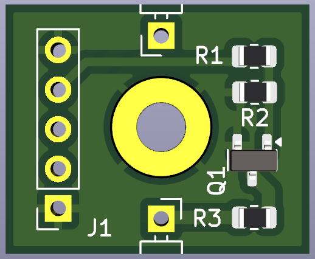
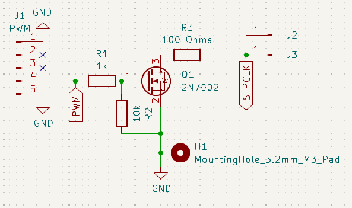

# PWM2STPCLK
Vintage CPU throttle adapter designed for use with interchangable PWM controllers. 

This project is inspired from the ThrottleBlaster project from Scrap Computing.

https://github.com/scrapcomputing/ThrottleBlaster

The PWM2STPCLK can mount directly to a standoff point from an ATX motherboard allowing for direct grounding and securing to the chassis. This allows placement of the STPCLK pin wiring to be close to CPU and guarded from strain. A standard PWM fan controller can be used for simplicity, but plans for developing dedicated controllers and adapting the ThrottleBlaster is on-going. 

## Support the Developer
This project is brought to you free and open source, but it is not free to develop. If you like this project please consider supporting this and future developments. 

https://www.patreon.com/RetroLoom